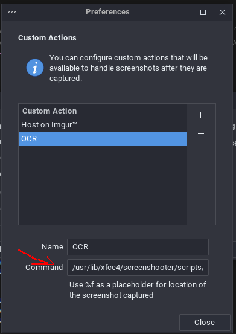

# XFCE-OCR

To use this script:
1. Ensure you have _tesseract-ocr_ installed according to your linux distribution.
2. copy the ocr.sh file to **/usr/lib/xfce4/screenshooter/scripts/**
3. Make the script executable: chmod +x ocr.sh
4. open screeshot app -> preference and add the new command **/usr/lib/xfce4/screenshooter/scripts/ocr.sh %f**
   
   

5. Now you can use ocr y using the print key. (use shift + ctrl + print for cropped screenshot)
